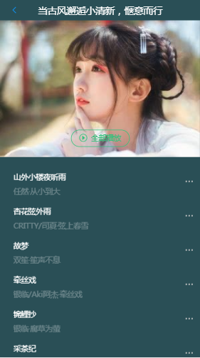
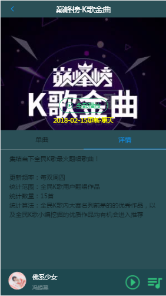
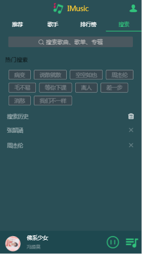
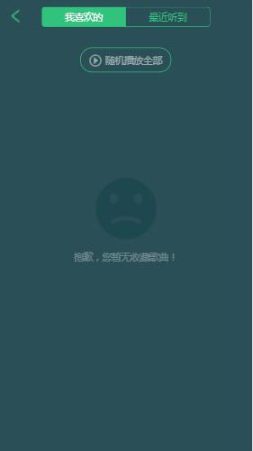

<p align="center">
    <a href="https://xieww.github.io/React-Music">
        
    </a>
</p>
<p align="center">
    React-Music
</p>
<p align="center">
  <a href="https://github.com/facebook/react"></a>
  <a href="https://github.com/ReactTraining/react-router"></a>
  <a href="https://github.com/reactjs/redux"></a>
  <a href="https://github.com/reactjs/react-redux"></a>
  <a href="https://github.com/reactjs/react-transition-group"></a>
  <a href="https://github.com/jasonslyvia/react-lazyload"></a>
</p>

## React-Music
## 注意：本项目只供学习，不可以商用。
##如果觉得本项目还不错，请给个star鼓励一下。

项目预览地址: https://xieww.github.io/React-Music.</p>
扫码体验更方便:

## 技术栈

React + React-Router + Redux + ES6 + JSONP


## 安装与运行

项目地址：（`git clone`）
```shell
git clone https://github.com/xieww/React-Music.git
```

通过`npm`安装本地服务以及第三方依赖模块(需要已安装[Node.js](https://nodejs.org/))

国内npm比较慢，可以使用国内淘宝的cnpm(https://npm.taobao.org/)

### `npm install`

项目`clone`之后需通过`npm install`安装依赖

### `npm start`

通过`npm start`运行项目，若没有修改webpack配置项，那么会自动打开浏览器，在3000端口预览项目<br>
[http://localhost:3000](http://localhost:3000).

### `npm run build`

项目开发完毕可以通过`npm run build`进行打包上线

若需要将项目上传至如`github`进行预览，可以安装([gh-pages](https://github.com/tschaub/gh-pages))会自动新建分支并部署一个静态项目进行预览,具体配置可参照gh-pages

## 项目截图

<p>
    
    
    
    
    
    
    
    
    
    
    
    
    
    
    
    
  
</p>